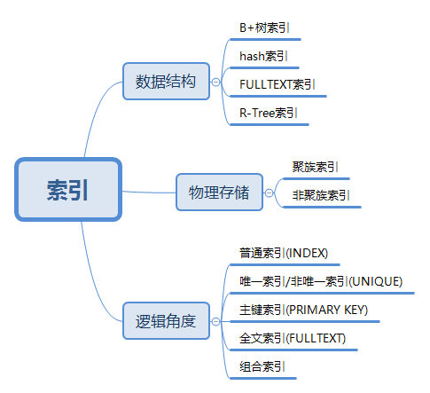

# 问题与简答

## MySQL 篇

### Mysql教程
扩展阅读[《mysql教程》](https://www.w3cschool.cn/mysql/)

### 体系结构

组成部分：SQL 接口，解析器，优化器，缓存，存储引擎


- Connectors：不同语言中与 SQL 的交互
- Management Serveices & Utilities： 系统管理和控制工具
- Connection Pool: 连接池
- SQL Interface: SQL 接口
- Parser: 解析器
- Optimizer: 查询优化器
- Cache 和 Buffer：查询缓存
- Engine：存储引擎

拓展阅读 [《MySQL体系结构》](./02.MySQL体系结构.md)

### 基础操作

#### 数据库管理

连接数据库、查看所有库、选择库、创建库、删除库

查看所有表、查看表结构、创建表、删除表

添加字段、删除字段、修改字段

#### CRUD

INSERT、SELECT、UPDATE、DELETE

#### 单表查询

所有字段、指定字段、WHERE、IN、BETWEEN AND、LIKE、AND、OR、DISTINCT、ORDER BY、GROUP BY、LIMIT

#### 多表查询

连接查询、子查询、合并结果

### 数据库设计范式

- 第一范式(1NF)：要求数据库表的每一列都是不可分割的基本数据项，同一列中不能有多个值
- 第二范式(2NF)：唯一性约束，每条记录有唯一标示，所有的非主键字段均需依赖于主键字段
- 第三范式(3NF)：冗余性约束，非主键字段间不能相互依赖

### 数据库设计原则

- 避免冗余属性，冗余属性会带来数据不一致性
- 一个表只存储它应该存储的信息，和此表无关的信息放到另一个表去存储，表之间尽量解耦
- 一个字段中不要出现分隔符，或者在一个字段中存储多个信息

### char 和 varchar 数据类型区别

- char：擅于存储经常改变的值，或者长度相对固定的值。比如 type、ip 地址或 md5 之类的数据，不容易产生碎片
- varchar：善于存储值的长短不一的列，也是用的最多的一种类型，节省磁盘空间，保存可变长度字符串。这也是 innodb 官方推荐的类型

### LEFT JOIN 、RIGHT JOIN、INNER JOIN

- LEFT JOIN(左连接)：获取左表所有记录，即使右表没有对应匹配的记录
- RIGHT JOIN(右连接)： 与 LEFT JOIN 相反，用于获取右表所有记录，即使左表没有对应匹配的记录
- INNER JOIN(内连接)：获取两个表中字段匹配关系的记录

拓展阅读 [《MySQL 连接的使用》](./01.MySQL连接的使用.md)

W3c-Mysql连接的使用[《MySQL 连接的使用》](https://www.w3cschool.cn/mysql/56ik1sqv.html)

### UNION、UNION ALL

- UNION 操作符用于连接两个以上的 SELECT 语句的结果组合到一个结果集合中。多个 SELECT 语句会删除重复的数据
- UNION ALL 操作符重复数据全部显示，不去重

### 常用 MySQL 函数

扩展阅读 [《MySQL 函数》](https://blog.csdn.net/sinat_38899493/article/details/78710482)

#### 数学函数

- floor(x) 返回不大于 x 的最大整数值
- ceil/ceiling(x) 返回不小于 x 的最小整数
- round(x) 四舍五入
- rand() 随机函数[0, 1)
- abs(x) 返回 x 的绝对值

#### 字符串函数

- concat(str1, str2, ...) 将参数连接成字符串返回
- length(str) 返回字符串长度

#### 日期和时间函数

- now() 当前时间
- curdate() 当前日期

```mysql
SELECT UNIX_TIMESTAMP('2019-05-07 22:55:00'); #1557240900
SELECT FROM_UNIXTIME(1557240900); #2019-05-07 22:55:00
```

#### 系统信息函数

- VERSION() 返回数据库的版本号
- LAST_INSERT_ID() 返回最后生成的 AUTO_INCREMENT 值

#### 加密函数

- PASSWORD(str) 对字符串 str 进行加密
- MD5(str) 对字符串 str 进行加密

#### 格式化函数

- FORMAT(x, n) 可以将数字 x 进行格式化，保留到小数点后 n 位，四舍五入

```mysql
SELECT FORMAT(2.7895, 2); #2.79
```

### MySQL索引原理和实现

#### 索引原理和实现
扩展阅读 [《MySQL索引原理和实现》](./04.Mysql索引原理和实现.md)

### 锁

### 事务
扩展阅读 [《MySQL的四种事务隔离级别》](https://www.cnblogs.com/jkko123/p/10181870.html)

### 常见存储引擎

#### InnoDB

- 很重要的存储引擎，很多个人和公司都对其贡献代码，而不仅仅是 Oracle 公司的开发团队
- 支持事务，行级锁，删除或者增加索引时不需要复制全表数据
- InnoDB 采用 MVCC 来支持高并发，实现了四个标准的隔离级别
- InnoDB 表是基于聚族索引建立的，聚族索引对主键查询有很高的性能
- InnoDB 内部做了很多优化，包括可预测性预读，加速读操作的自适应哈希索引，加速插入操作的插入缓冲区
- 作为事务性的存储引擎，InnoDB 通过一些机制和工具支持真正的热备份

#### MyISAM

- 不支持事务和行级锁，崩溃后无法安全恢复，表锁非常影响性能
- MyISAM 对整张表加锁，而不是针对行。读取时对需要读到的表加共享锁，写入则加排它锁。在表有读取查询的同事，也可以插入新记录(支持并发插入)
- 支持延迟更新索引健，极大的提升写入性能
- 支持全文索引，可以支持复杂的查询
- MyISAM 将表存储在两个文件中，数据文件和索引文件

### 常见索引

#### 索引概念

索引是存储引擎用于快速找到记录的一种数据结构

#### 索引分类



#### 索引创建

```mysql
ALTER TABLE `table_name` ADD INDEX index_name (`column`); #普通索引
```

```mysql
ALTER TABLE `table_name` ADD UNIQUE (`column`); #唯一索引
```

```mysql
ALTER TABLE `table_name` ADD PRIMARY KEY (`column`); #主键索引
```

```mysql
ALTER TABLE `table_name` ADD FULLTEXT (`column`); #全文索引
```

```mysql
ALTER TABLE `table_name` ADD INDEX index_name (`column1`, `column2`, `column3`); #组合索引
```

#### 索引区别

- 普通索引：最基本的索引，没有任何限制
- 唯一索引：与"普通索引"类似，不同的就是：索引列的值必须唯一，但允许有空值
- 主键索引：它是一种特殊的唯一索引，不允许有空值
- 全文索引：仅可用于 MyISAM 表，针对较大的数据，生成全文索引很耗时好空间
- 组合索引：为了更多的提高 MySQL 效率可建立组合索引，遵循"最左前缀"原则

### 聚族索引与非聚族索引的区别


### BTree 与 BTree-/BTree+ 索引原理

- BTree

二叉树导致树高度非常高，逻辑上很近的节点，物理上非常远，无法利用局部性，IO 次数多，查找效率低

- BTree-

每个节点都是二元数组[key,data]，所有节点都可以存储数据，key 为索引，data 为索引外的数据。插入删除数据会破坏 BTree 性质，插入数据时候，需要对数据进行分裂、合并、转移等操作保持 BTree 性质，造成 IO 操作频繁

- BTree+

非叶子节点不存储 data，只存储索引 key，只有叶子节点才存储 data

- MySQL中的 BTree+

在经典 BTree+ 的基础上进行了优化，增加了顺序访问指针。在 BTree+ 的每个叶子节点增加了一个指向相邻叶子节点的指针，形成了带顺序访问指针的 BTree+，提高了区间访问性能

### 分表数量级

MySQL 单表容量在`500万`左右，性能处于最佳状态，此时，MySQL 的 BTREE 索引树高在3～5之间

### EXPLAIN 输出格式


### my.cnf 配置

### 慢查询