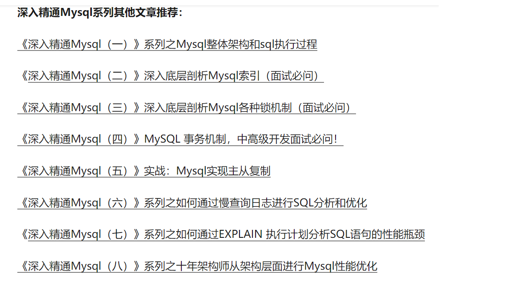

# Mysql整理

## 目录

- [关系型数据库](#关系型数据库)
- [mysql教程](https://www.w3cschool.cn/mysql/)

- [mysql技术文章](#mysql技术文章)

- [设计范式](#设计范式)

- [索引](#索引)
  - [mysql索引](#mysql索引)
  - [mysql为什么用b+树做索引](#mysql为什么用b+树做索引)
  - [索引的实现原理](./mysql索引及实现原理.md)
  - [索引的优缺点](#索引的优缺点)
  - [索引分类](#索引分类)
  - [索引失效条件](#索引失效条件)
  - [什么时候需要创建索引](#什么时候需要创建索引)
  - [什么时候不需要创建索引](#什么时候不需要创建索引)
  - [联合索引(组合索引)](https://blog.csdn.net/wdjxxl/article/details/79790421)
  - [读完这篇彻底弄清楚MySQL优化问题](https://zhuanlan.zhihu.com/p/72855648)
  - [聚集索引和非聚集索引](https://mp.weixin.qq.com/s?__biz=MjM5ODYxMDA5OQ==&mid=2651961494&idx=1&sn=34f1874c1e36c2bc8ab9f74af6546ec5&chksm=bd2d0d4a8a5a845c566006efce0831e610604a43279aab03e0a6dde9422b63944e908fcc6c05&scene=21#wechat_redirect)
  - [MySQL索引背后的数据结构及算法原理](http://blog.codinglabs.org/articles/theory-of-mysql-index.html)
  
- [Explain分析sql](https://www.cnblogs.com/wangfengming/articles/8275448.html)
  
- 锁
   - 锁详解
   - 乐观锁/悲观锁
   - [MySQL的并发控制与加锁分析](#MySQL的并发控制与加锁分析)

- [事务](#事务)
  - [什么是事务](#什么是事务)
  - [事务隔离级别](#事务隔离级别)
  - 两阶段提交
  - 分布式事务
  - mvcc
  
- [存储引擎](#存储引擎)
  - [存储引擎概述](#存储引擎概述)
  - [innodb存储引擎](#innodb存储引擎)
  - [myisam与innodb区别](#myisam与innodb区别)
  - [myisam与innodb适应场景](#myisam与innodb如何选择)
  - [innodb中一棵B+树能存多少行数据](#innodb中一棵B+树能存多少行数据)
  
  - [Innodb为什么推荐使用自增ID作为主键](#innodb为什么推荐使用自增id作为主键)
  - [innodb引擎的4大特性](#innodb引擎的4大特性)
  - [innodb的磁盘文件及落盘机制](https://zhuanlan.zhihu.com/p/62251242)
  - [Innodb架构介绍之磁盘篇](https://zhuanlan.zhihu.com/p/95165042)
  
- [mysql优化](#mysql优化)

- mysql复制
  - [主从复制原理](#mysql主从复制原理)
  - [mysql主从同步延迟分析及解决方案](#mysql主从同步延迟分析及解决方案)
  - 半同步复制
- [MySQL日志的分类](https://blog.csdn.net/lzh_00/article/details/90299354)

- mysql 分库 分表

- [mysql面试题集锦](#mysql面试题集锦)
  
  
### 关系型数据库
关系型数据库，是指采用了关系模型来组织数据的数据库，其以行和列的形式存储数据，以便于用户理解，关系型数据库这一系列的行和列被称为表，一组表组成了数据库。用户通过查询来检索数据库中的数据，而查询是一个用于限定数据库中某些区域的执行代码。关系模型可以简单理解为二维表格模型，而一个关系型数据库就是由二维表及其之间的关系组成的一个数据组织(摘自: 百度 百科)
  
  
### mysql教程
[mysql教程](https://www.w3cschool.cn/mysql/)

### mysql技术文章

- [InnoDB的缓冲池](https://mp.weixin.qq.com/s?__biz=MjM5ODYxMDA5OQ==&mid=2651962450&idx=1&sn=ce17c4da8d20ce275f75d0f2ef5e40c9&chksm=bd2d098e8a5a809834aaa07da0d7546555385543fb6d687a7cf94d183ab061cd301a76547411&mpshare=1&scene=23&srcid=&sharer_sharetime=1577416523221&sharer_shareid=ace4730136c387f33fdbac348d21258c#rd)
- [写缓冲(change buffer)](https://mp.weixin.qq.com/s?__biz=MjM5ODYxMDA5OQ==&mid=2651962467&idx=1&sn=899ea157b0fc6f849ec80a4d055a309b&chksm=bd2d09bf8a5a80a972a2e16a190ed7dffe03f89015ead707bdfcc5aeb8388fb278f397c125f1&mpshare=1&scene=23&srcid=&sharer_sharetime=1577416865513&sharer_shareid=ace4730136c387f33fdbac348d21258c#rd)
- [mysql原理与特性](https://www.cnblogs.com/Aiapple/tag/mysql%E5%8E%9F%E7%90%86%E4%B8%8E%E7%89%B9%E6%80%A7/)
- [《深入精通Mysql系列文章推荐》](https://zhuanlan.zhihu.com/p/101319550)

### 设计范式

- 第一范式(1NF)：要求数据库表的每一列都是不可分割的基本数据项，同一列中不能有多个值
- 第二范式(2NF)：唯一性约束，每条记录有唯一标示，所有的非主键字段均需依赖于主键字段
- 第三范式(3NF)：冗余性约束，非主键字段间不能相互依赖

## 索引

### mysql索引

参考文章 [mysql索引](https://www.cnblogs.com/Aiapple/p/5693239.html)

### mysql为什么用b+树做索引
[《原文-mysql为什么用b+树做索引》](https://www.cnblogs.com/xufengnian/p/11885724.html#_label2)

一、B-Tree的性质
1、定义任意非叶子结点最多只有M个儿子，且M>2；
2、根结点的儿子数为[2, M]；
3、除根结点以外的非叶子结点的儿子数为[M/2, M]；
4、每个结点存放至少M/2-1（取上整）和至多M-1个关键字；（至少2个关键字）
5、非叶子结点的关键字个数=指向儿子的指针个数-1；
6、非叶子结点的关键字：K[1], K[2], …, K[M-1]；且K[i] < K[i+1]；
7、非叶子结点的指针：P[1], P[2], …, P[M]；其中P[1]指向关键字小于K[1]的子树，P[M]指向关键字大于K[M-1]的子树，其它P[i]指向关键字属于(K[i-1], K[i])的子树；
8、所有叶子结点位于同一层；

二、B+Tree
B+树的性质(下面提到的都是和B树不相同的性质)
1、非叶子节点的子树指针与关键字个数相同；
2、非叶子节点的子树指针p[i],指向关键字值属于[k[i],k[i+1]]的子树.(B树是开区间,也就是说B树不允许关键字重复,B+树允许重复)；
3、为所有叶子节点增加一个链指针；
4、所有关键字都在叶子节点出现(稠密索引). (且链表中的关键字恰好是有序的)；
5、非叶子节点相当于是叶子节点的索引(稀疏索引),叶子节点相当于是存储(关键字)数据的数据层；
6、更适合于文件系统；

三、为什么说B+树比B树更适合数据库索引
1、 B+树的磁盘读写代价更低：B+树的内部节点并没有指向关键字具体信息的指针，因此其内部节点相对B树更小，如果把所有同一内部节点的关键字存放在同一盘块中，那么盘块所能容纳的关键字数量也越多，一次性读入内存的需要查找的关键字也就越多，相对IO读写次数就降低了。
2、B+树的查询效率更加稳定：由于非终结点并不是最终指向文件内容的结点，而只是叶子结点中关键字的索引。所以任何关键字的查找必须走一条从根结点到叶子结点的路。所有关键字查询的路径长度相同，导致每一个数据的查询效率相当。
3、由于B+树的数据都存储在叶子结点中，分支结点均为索引，方便扫库，只需要扫一遍叶子结点即可，但是B树因为其分支结点同样存储着数据，我们要找到具体的数据，需要进行一次中序遍历按序来扫，所以B+树更加适合在区间查询的情况，所以通常B+树用于数据库索引。

四、提升效率
B树在提高了IO性能的同时并没有解决元素遍历的我效率低下的问题，正是为了解决这个问题，B+树应用而生。B+树只需要去遍历叶子节点就可以实现整棵树的遍历。而且在数据库中基于范围的查询是非常频繁的，而B树不支持这样的操作或者说效率太低。
查找数据，最简单的方式是顺序查找。但是对于几十万上百万，甚至上亿的数据库查询就很慢了。
所以要对查找的方式进行优化，熟悉的二分查找，二叉树可以把速度提升到O(log(n,2))，查询的瓶颈在于树的深度，最坏的情况要查找到二叉树的最深层，由于，每查找深一层，就要访问更深一层的索引文件。在多达数G的索引文件中，这将是很大的开销。所以，尽量把数据结构设计的更为‘矮胖’一点就可以减少访问的层数。在众多的解决方案中，B-/B+树很好的适合。B-树定义具体可以查阅，简而言之就是中间节点可以多余两个子节点，而且中间的元素可以是一个域。相比B-树，B+树的父节点也必须存在于子节点中，是其中最大或者最小元素，B+树的节点只存储索引key值，具体信息的地址存在于叶子节点的地址中。这就使以页为单位的索引中可以存放更多的节点。减少更多的I/O支出。因此，B+树成为了数据库比较优秀的数据结构，MySQL中myisam和innodb都是采用的B+树结构。不同的是前者是非聚集索引，后者主键是聚集索引，所谓聚集索引是物理地址连续存放的索引，在取区间的时候，查找速度非常快，但同样的，插入的速度也会受到影响而降低。聚集索引的物理位置使用链表来进行存储。

### 索引分类

扩展阅读 [《索引分类》](https://www.cnblogs.com/luyucheng/p/6289714.html)

### MySQL索引及其实现原理(基于myisam及innodb引擎)

扩展阅读 [《MySQL索引及其实现原理》](https://cloud.tencent.com/developer/article/1125452)
  
### 索引的优缺点

#### 缺点

1.虽然索引大大提高了查询速度，同时却会降低更新表的速度，如对表进行insert、update和delete。因为更新表时，不仅要保存数据，还要保存一下索引文件。

2.建立索引会占用磁盘空间的索引文件。一般情况这个问题不太严重，但如果你在一个大表上创建了多种组合索引，索引文件的会增长很快。
索引只是提高效率的一个因素，如果有大数据量的表，就需要花时间研究建立最优秀的索引，或优化查询语句。

#### 优点
可以快速检索，减少I/O次数，加快检索速度；根据索引分组和排序，可以加快分组和排序
  
### 索引失效条件

1、like 以%开头，索引无效；当like前缀没有%，后缀有%时，索引有效。

2、 or语句前后没有同时使用索引。当or左右查询字段只有一个是索引，该索引失效，只有当or左右查询字段均为索引时，才会生效

3、 组合索引，如果查询中没有用到联合索引的第一个字段，则不会走索引

4、数据类型出现隐式转化。如varchar不加单引号的话可能会自动转换为int型，使索引无效，产生全表扫描

5、 在索引列上使用 IS NULL 或 IS NOT NULL操作。索引是不索引空值的，所以这样的操作不能使用索引，可以用其他的办法处理，例如：数字类型，判断大于0，字符串类型设置一个默认值，判断是否等于默认值即可

6、 在索引字段上使用not，<>，!=。不等于操作符是永远不会用到索引的，因此对它的处理只会产生全表扫描。 优化方法： key<>0 改为 key>0 or key<0

7、对索引字段进行计算操作、字段上使用函数。（索引为 emp(ename,empno,sal)）

8、当全表扫描速度比索引速度快时，mysql会使用全表扫描，此时索引失效

扩展阅读 [《索引失效》](https://blog.csdn.net/wuseyukui/article/details/72312574)

扩展阅读 [《索引失效》](https://www.cnblogs.com/wdss/p/11186411.html)

### Mysql联合索引
扩展阅读 [《联合索引》](https://blog.csdn.net/wdjxxl/article/details/79790421)

### MySQL EXPLAIN 输出信息解读
扩展阅读 [《explain 输出信息解读》](https://www.cnblogs.com/wangfengming/articles/8275448.html)

### 什么时候需要创建索引

- 主键自动建立唯一索引

- 频繁作为查询条件的字段应该创建索引

- 查询中排序的字段创建索引将大大提高排序的速度（索引就是排序加快速查找

- 查询中统计或者分组的字段；

### 什么时候不需要创建索引

- 频繁更新的字段不适合创建索引，因为每次更新不单单是更新记录，还会更新索引，保存索引文件

- where条件里用不到的字段，不创建索引；

- 表记录太少，不需要创建索引；

- 经常增删改的表；

- 数据重复且分布平均的字段，因此为经常查询的和经常排序的字段建立索引。注意某些数据包含大量重复数据，因此他建立索引就没有太大的效果，例如性别字段，只有男女，不适合建立索引。

### 锁

#### MySQL的并发控制与加锁分析

参考文章 [《MySQL的并发控制与加锁分析》](https://www.cnblogs.com/yelbosh/p/5813865.html)

### 事务

#### 什么是事务

一系列有序的数据库操作：要么全部成功,要么全部回退到操作前状态,中间状态对其他连接不可见

#### 事务隔离级别
[事务隔离级别](https://www.cnblogs.com/Aiapple/p/5686554.html)

#### 分布式事务
- 参考文章:
    - [深入理解分布式事务,高并发下分布式事务的解决方案](https://blog.csdn.net/mine_song/article/details/64118963)
    - [理解分布式系统—从ACID到BASE](https://blog.csdn.net/lemon89/article/details/53750464)
    
### 存储引擎

#### 存储引擎概述

参考文章 [《存储引擎概述》](https://www.cnblogs.com/Aiapple/p/5687561.html)

#### innodb存储引擎

参考文章 [《innodb存储引擎》](https://www.cnblogs.com/Aiapple/p/5792939.html?spm=a2c4e.10696291.0.0.48ef19a41AArtz)

#### myisam与innodb区别

1、 innodb支持事务，myisam不支持，对于innodb每一条SQL语言都默认封装成事务，自动提交，这样会影响速度，所以最好把多条SQL语言放在begin和commit之间，组成一个事务

2、 innodb支持外键，而myisam不支持。对一个包含外键的innodb表转为myisam会失败

3、 innodb是聚集索引，使用B+Tree作为索引结构，数据文件是和（主键）索引绑在一起的（表数据文件本身就是按B+Tree组织的一个索引结构），必须要有主键，通过主键索引效率很高。但是辅助索引需要两次查询，先查询到主键，然后再通过主键查询到数据。因此，主键不应该过大，因为主键太大，其他索引也都会很大

 myisam是非聚集索引，也是使用B+Tree作为索引结构，索引和数据文件是分离的，索引保存的是数据文件的指针。主键索引和辅助索引是独立的
 
 也就是说：innodb的B+树主键索引的叶子节点就是数据文件，辅助索引的叶子节点是主键的值；而myisam的B+树主键索引和辅助索引的叶子节点都是数据文件的地址指针
 
4、innodb中不保存表的 具体行数，也就是说，执行select count() from table时，innodb要扫描一遍整个表来计算有多少行，但是myisam只要简单的读出保存好的行数即可。注意的是，当count()语句包含 where条件时，两种表的操作是一样的

那么为什么innodb没有了这个变量呢？

    因为innodb的事务特性，在同一时刻表中的行数对于不同的事务而言是不一样的，因此count统计会计算对于当前事务而言可以统计到的行数，而不是将总行数储存起来方便快速查询。innodb会尝试遍历一个尽可能小的索引除非优化器提示使用别的索引。如果二级索引不存在，innodb还会尝试去遍历其他聚簇索引。
    如果索引并没有完全处于innodb维护的缓冲区（Buffer Pool）中，count操作会比较费时。可以建立一个记录总行数的表并让你的程序在INSERT/DELETE时更新对应的数据。和上面提到的问题一样，如果此时存在多个事务的话这种方案也不太好用。如果得到大致的行数值已经足够满足需求可以尝试SHOW TABLE STATUS

5、 innodb不支持全文索引，而myisam支持全文索引，在涉及全文索引领域的查询效率上myisam速度更快高；PS：5.7以后的innodb支持全文索引了

6、myisam表格可以被压缩后进行查询操作

7、innodb支持表、行(默认)级锁，而myisam支持表级锁

innodb的行锁是实现在索引上的，而不是锁在物理行记录上。潜台词是，如果访问没有命中索引，也无法使用行锁，将要退化为表锁。

8、innodb表必须有主键（用户没有指定的话会自己找或生产一个主键），而myisam可以没有

9、innodb存储文件有frm、ibd，而myisam是frm、MYD、MYI
> innodb：frm是表定义文件，ibd是数据文件

> myisam：frm是表定义文件，myd是数据文件，myi是索引文件

#### myisam与innodb如何选择

1、适用场景

myisam适合：(1)做很多count 的计算；(2)插入不频繁，查询非常频繁；(3)没有事务。

innodb适合：(1)可靠性要求比较高，或者要求事务；(2)表更新和查询都相当的频繁，并且表锁定的机会比较大的情况。

2、如何选择

MYISAM和INNODB是Mysql数据库提供的两种存储引擎。两者的优劣可谓是各有千秋。INNODB会支持一些关系数据库的高级功能，如事务功能和行级锁，MYISAM不支持。MYISAM的性能更优，占用的存储空间少。所以，选择何种存储引擎，视具体应用而定。

如果你的应用程序一定要使用事务，毫无疑问你要选择INNODB引擎。但要注意，INNODB的行级锁是有条件的。在where条件没有使用主键时，照样会锁全表。比如DELETE FROM mytable这样的删除语句。

如果你的应用程序对查询性能要求较高，就要使用MYISAM了。MYISAM索引和数据是分开的，而且其索引是压缩的，可以更好地利用内存。所以它的查询性能明显优于INNODB。压缩后的索引也能节约一些磁盘空间。MYISAM拥有全文索引的功能，这可以极大地优化LIKE查询的效率。

#### innodb为什么推荐使用自增ID作为主键
自增ID可以保证每次插入时B+索引是从右边扩展的，可以避免B+树频繁合并和分裂（对比使用UUID）。如果使用字符串主键和随机主键，会使得数据随机插入，效率比较差

参考文章 [InnoDB表为什么要建议用自增列做主键](https://blog.csdn.net/wukong_666/article/details/54982712)

#### innodb引擎的4大特性
- 插入缓冲（insert buffer)
- 二次写(double write)
- 自适应哈希索引(ahi)
- 预读(read ahead)

详细解释 [《innodb引擎的4大特性》](https://www.cnblogs.com/zhs0/p/10528520.html)

    
### mysql优化
参考文章 [《我必须得告诉大家的MySQL优化原理》](https://www.jianshu.com/p/d7665192aaaf)

参考文章 [《我必须得告诉大家的MySQL优化原理2》](https://www.jianshu.com/p/01b9f028d9c7)

参考文章 [《mysql优化》](https://www.cnblogs.com/Aiapple/p/5697229.html)

### mysql复制

#### mysql主从复制原理

参考文章 [《mysql复制原理》](https://baijiahao.baidu.com/s?id=1617888740370098866&wfr=spider&for=pc)

参考文章 [《mysql复制原理》](https://www.cnblogs.com/Aiapple/p/5792939.html?spm=a2c4e.10696291.0.0.48ef19a41AArtz)

参考文章 [《mysql主从复制实践》](https://www.cnblogs.com/Aiapple/p/5793786.html)

#### mysql主从同步延迟分析及解决方案

参考文章 [<谈谈Mysql主从同步延迟分析及解决方案>](https://www.cnblogs.com/phpper/p/8904169.html)

### mysql面试题集锦

#### 1、MySQL中存储索引用到的数据结构是B+树，B+树的查询时间跟树的高度有关，是log(n)，如果用hash存储，那么查询时间是O(1)。既然hash比B+树更快，为什么mysql用B+树来存储索引呢？

答：一、从内存角度上说，数据库中的索引一般时在磁盘上，数据量大的情况可能无法一次性装入内存，B+树的设计可以允许数据分批加载。

二、从业务场景上说，如果只选择一个数据那确实是hash更快，但是数据库中经常会选中多条这时候由于B+树索引有序，并且又有链表相连，它的查询效率比hash就快很多了。

#### 2、为什么不用红黑树或者二叉排序树？

答：树的查询时间跟树的高度有关，B+树是一棵多路搜索树可以降低树的高度，提高查找效率

#### 3、既然增加树的路数可以降低树的高度，那么无限增加树的路数是不是可以有最优的查找效率？

答：这样会形成一个有序数组，文件系统和数据库的索引都是存在硬盘上的，并且如果数据量大的话，不一定能一次性加载到内存中。有序数组没法一次性加载进内存，这时候B+树的多路存储威力就出来了，可以每次加载B+树的一个结点，然后一步步往下找，

#### 4、在内存中，红黑树比B树更优，但是涉及到磁盘操作B树就更优了，那么你能讲讲B+树吗？

B+树是在B树的基础上进行改造，它的数据都在叶子结点，同时叶子结点之间还加了指针形成链表。

下面是一个4路B+树，它的数据都在叶子结点，并且有链表相连。

#### 5、为什么B+树要这样设计？

答：这个跟它的使用场景有关，B+树在数据库的索引中用得比较多，数据库中select数据，不一定只选一条，很多时候会选中多条，比如按照id进行排序后选100条。如果是多条的话，B+树需要做局部的中序遍历，可能要跨层访问。而B+树由于所有数据都在叶子结点不用跨层，同时由于有链表结构，只需要找到首尾，通过链表就能把所有数据取出来了。

#### 史上最详细的一线大厂Mysql面试题详解

原文地址 [《史上最详细的一线大厂Mysql面试题详解》](https://zhuanlan.zhihu.com/p/68026501)