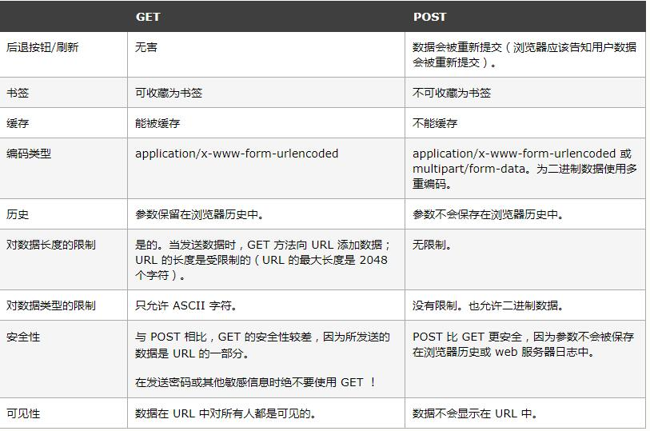
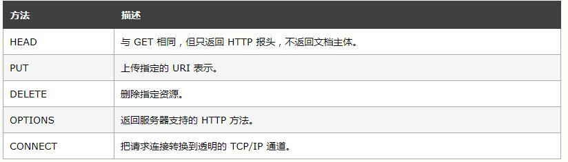

原文地址[《HTTP 方法：GET 对比 POST》](https://www.w3school.com.cn/tags/html_ref_httpmethods.asp)
## get和post的区别

### get方法

有关 GET 请求的其他一些注释：

- GET 请求可被缓存
- GET 请求保留在浏览器历史记录中
- GET 请求可被收藏为书签
- GET 请求不应在处理敏感数据时使用
- GET 请求有长度限制
- GET 请求只应当用于取回数据

### post方法

请注意，查询字符串（名称/值对）是在 POST 请求的 HTTP 消息主体中发送的：

```
POST /test/demo_form.asp HTTP/1.1
Host: w3schools.com
name1=value1&name2=value2

```
有关 POST 请求的其他一些注释：

- POST 请求不会被缓存
- POST 请求不会保留在浏览器历史记录中
- POST 不能被收藏为书签
- POST 请求对数据长度没有要求

### 比较 GET 与 POST
下面的表格比较了两种 HTTP 方法：GET 和 POST。




### 其他 HTTP 请求方法
下面的表格列出了其他一些 HTTP 请求方法：
