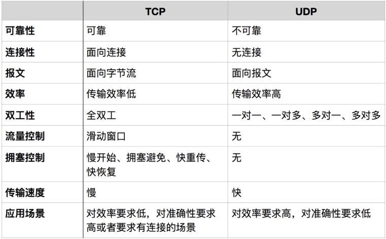

## 网络

###目录

- [计算机网络体系结构](#计算机网络体系结构)
- [网络模型](#网络模型)
   - [网络io模型](#网络io模型)
   - [网络IO之阻塞、非阻塞、同步、异步总结](#网络IO之阻塞、非阻塞、同步、异步总结)
   - [IO多路复用的三种机制Select，Poll，Epoll](#IO多路复用的三种机制Select，Poll，Epoll)
- 网络协议
   - [一篇文章带你熟悉 TCP/IP 协议](https://www.jianshu.com/p/9f3e879a4c9c)
   - tcp(传输控制协议)
   - udp(用户数据报协议)
   - tcp与udp区别
   - [一篇文章带你详解 HTTP 协议](https://www.jianshu.com/p/6e9e4156ece3)
- https 原理
- socket
- HTTP与WebSocket的区别
- [计算机网络协议高频面试题](https://mp.weixin.qq.com/s?__biz=MzAxMjEwMzQ5MA==&mid=2448885757&idx=1&sn=0b234017a3312359c2da2cfcedb56f19&chksm=8fb55dd0b8c2d4c6e75e34f9a3701e0fd0aa99de447d6568281bffda42c9a1faf597b5a066e7&scene=21#wechat_redirect)

### 计算机网络体系结构

#### 各层作用
     
- 应用层：应用层协议定义的是应用进程间通信和交互的规则
- 运输层：运输层的任务就是负责向`两台主机中进程之间的通信`提供`通用的数据传输`服务
- 网络层：把运输层产生的报文段或用户数据报封装成`分组`或`包`进行传送
- 数据链路层：将网络层交下来的 IP 数据报组装成帧，并在两个相邻结点间的链路上传送
- 物理层：利用物理媒体以`比特`形式传送数据

### 网络模型

#### 网络io模型

- [Linux IO模式及 select、poll、epoll详解](https://segmentfault.com/a/1190000003063859)

#### 网络IO之阻塞、非阻塞、同步、异步总结
- [一篇文章读懂阻塞，非阻塞，同步，异步](https://www.jianshu.com/p/b8203d46895c)

#### IO多路复用的三种机制Select，Poll，Epoll
- [IO模式及 select、poll、epoll详解](https://www.cnblogs.com/Anker/p/3254269.html)

- [IO多路复用的三种机制Select，Poll，Epoll](https://www.jianshu.com/p/397449cadc9a)

### 网络协议
#### tcp与udp区别

面向报文

面向报文的传输方式是应用层交给UDP多长的报文，UDP发送多长的报文，即一次发送一个报文。因此，应用程序必须选择合适大小的报文。

面向字节流

虽然应用程序和TCP的交互是一次一个数据块(大小不等)，但TCP把应用程序看成是一连串的无结构的字节流。TCP有一个缓冲，当应该程序传送的数据块太长，TCP就可以把它划分短一些再传送。

### tcp/udp
- [一文搞懂什么是TCP/IP协议](https://blog.csdn.net/petterp/article/details/102779131)
- [网络协议](https://www.cnblogs.com/Soy-technology/p/11102239.html)

### 参考资料

- [计算机网络面试常考总结](https://www.cnblogs.com/anzhengyu/p/11238563.html)
- [网络协议-专题总结以及网络协议高频面试题汇总(8篇)](https://cloud.tencent.com/developer/article/1346228)
